#卓越软件开发 Project说明文档

**19级软件工程 吴逸昕 19302010013**

------------

### 1. 项目整体目录结构

```
    /PJ
        /out
        /src
            /com
                /servlets
                /classes
            /jdbc.properties
        /web
            /css
            /img
                /icons
                /large
                /normal-medium
            /js
            /WEB-INF
                /lib
                /web.xml
            /jsp
```

------------
### 2. 基础部分完成情况

#### 2.1 导航栏
        
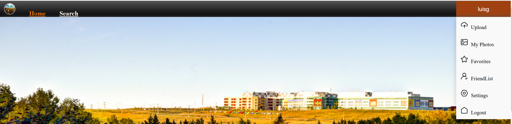

- 左侧导航标签与右侧用户名下拉菜单/登录按钮在鼠标移过时均有颜色渐变效果；
登录前右上角显示“Login”，登录后显示登录所用的用户名（使用邮箱登录时连接数据库获取相应用户名）；
下拉菜单各元素在鼠标移过时会由浅灰色变为深灰色。

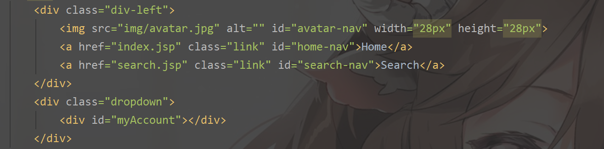

- 此处使用到ajax与一个`NavDropdownServlet`，使用ajax获取到id名为`myAccount`的元素所在位置，并连接到`NavDropdownServlet`进行打印。
- `NavDropdownServlet`中先获取cookies用于显示用户名，再根据这个表示用户名的cookie是否存在决定打印“Login”还是下拉菜单。

#### 2.2 注册与登录

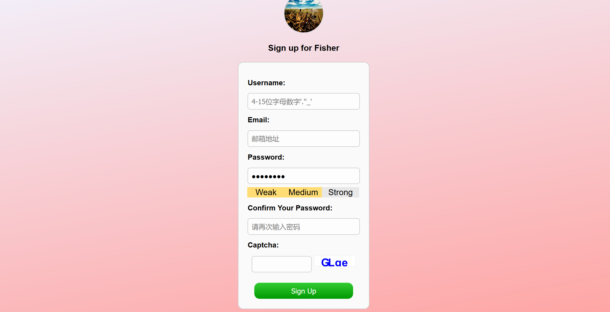

- 以注册为例，此处使用到了`register.jsp` `registerRedirect.jsp`两个jsp界面与一个`RegisterServlet`，提交注册时先跳转到`RegisterServlet`，若通过则转发至`registerRedirect.jsp`并在三秒后跳转到登录前界面。
- 先在本地js判断用户输入的格式是否有误以及两次密码是否相符；若通过则表单提交至`RegisterServlet`，在其中先检测验证码是否正确，若有误返回注册界面，并通过cookie的形式将之前填的信息传回以实现不清空文本框的效果；
若验证码正确则从数据库中获取用户名邮箱信息判断是否重复；若不重复则将用户信息存入数据库并生成一个时效为24小时的存有当前用户名的cookie。
- 登录同理。

#### 2.3 首页

  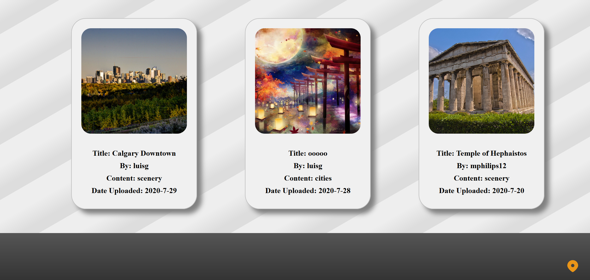

- 用户点击左右两侧按钮或点击下方按钮或等待三秒均会实现轮播效果。
- 建立了PicProperties类用于封装图片信息，只要有图片id便可通过`setPicProperties(int picID)`方法从数据库获取并设置其所有属性，以便输出信息使用。
- 筛选收藏数最多的图片：先遍历收藏信息数据库，用一个数组记录每张图片出现的次数，其键名为相应的图片id，再筛选出该数组中最大的五个值并记录下相应键名，即得到收藏数最多的五张图片，再调用PicProperties获取图片路径显示图片。
- 最新图片即`ORDER BY UploadDate DESC`。

#### 2.4 详情页面

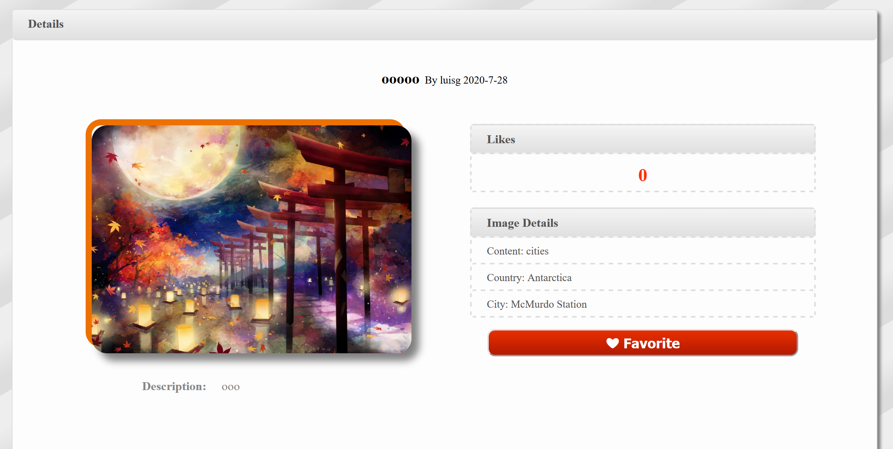

- 通过url传递当前图片id，获取后调用PicProperties获取图片相应的信息并显示。
- 在进入时创建一个名为`DETAILS_ID_id名`的cookie，用于收藏界面浏览足迹功能。
- 从`travelimagefavor`表中获取当前用户是否收藏了该图片，若收藏了则显示取消收藏按钮，没收藏则显示收藏按钮；这两个按钮分别导向一个servlet执行添删操作。

#### 2.5 搜索

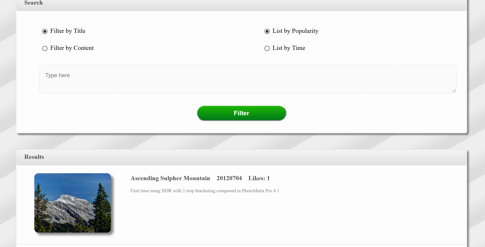

- 建立了PagesProperties类，通过传入每页图片数与总图片数可以打印页码。
- 通过表单将输入的内容以及选择的筛选方式传递给`SearchServlet`，在其中获得一个字符串返回给jsp页面通过out打印。
- 若未输入内容或无搜索结果均会有相应显示提示；SQL中使用了`‘%content%’`结构模糊查询；将搜索方式用条件语句归为了四类；收藏数与时间排序方法与首页所用方法类似。
- 使用`pages.js`通过传入每页图片数并获取每张图片id编号生成函数，点击时对图片样式的`display`属性进行更改以达到分页效果。

#### 2.6 上传界面

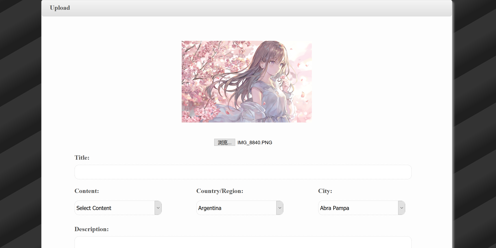

- 在session中设置了如当前图片id等多个属性并通过判断这些属性的值是否为空，在“上传图片”与“修改图片”中间选一显示，同时也通过这些属性在修改时自动填入图片信息。
- 使用了jQuery的confirm方法实现了弹出确认框效果。


#### 2.7 我的照片

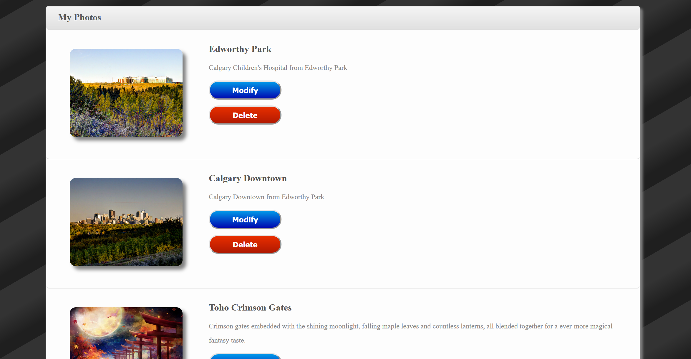

- 图片显示原理同收藏与搜索，确认框使用jQuery完成。

#### 2.8 我的收藏

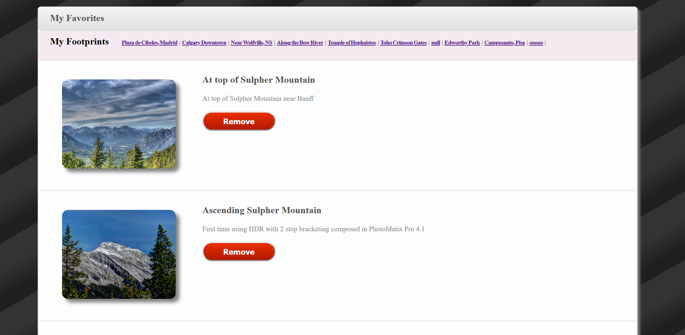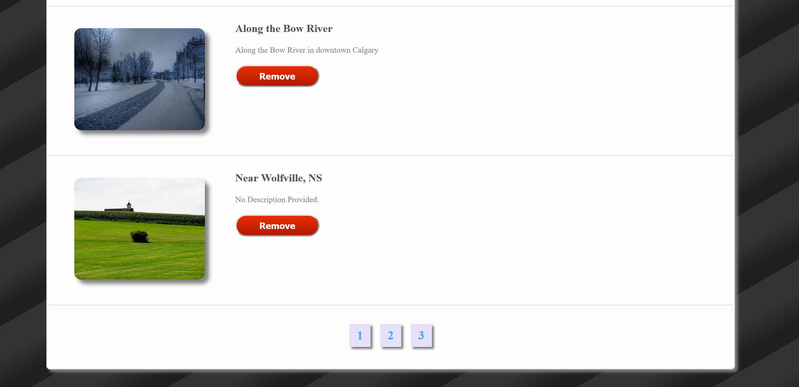

- 获取details页面设的`DETAILS_ID_`开头的cookie以实现历史足迹功能，当超过十个的时候会删除第一个，当再次访问之前访问过的图片时会删去相应id并重新再添加。
- 用一个计数器记录打印图片的张数，传递给PagesProperties完成分页功能。


#### 2.9 好友列表

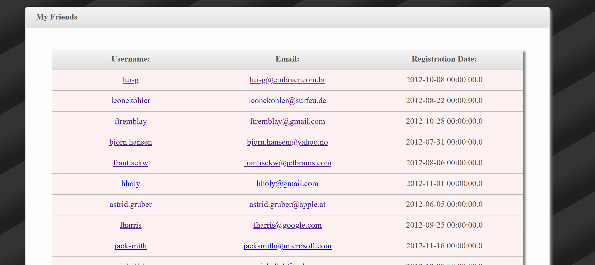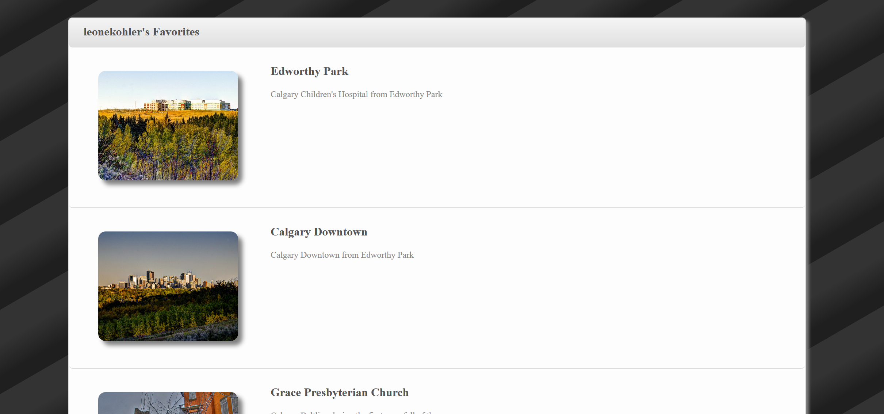

- 先打印用户列表，其中每个超链接均含有该用户对应的uid，并在好友收藏界面通过获取此uid复用收藏界面显示好友名与好友的收藏；在显示之前会先获取traveluser中新增的一列PermitVisit的值，若为1则可访问，为0则不可访问。
- 制作了设置页面，其中设有一组按钮用于更改可访问/不可访问属性。

   
-------------
### 3. Bonus完成情况

#### 3.0 项目说明文档

- 即本文档。

#### 3.1 图片局部放大功能

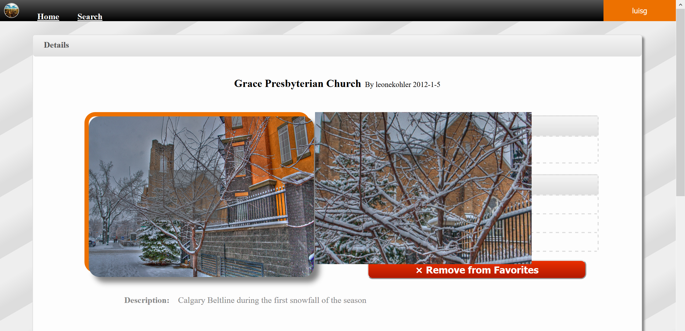

#### 3.2 验证码功能

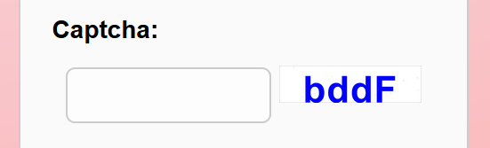

#### 3.3 用户评论功能

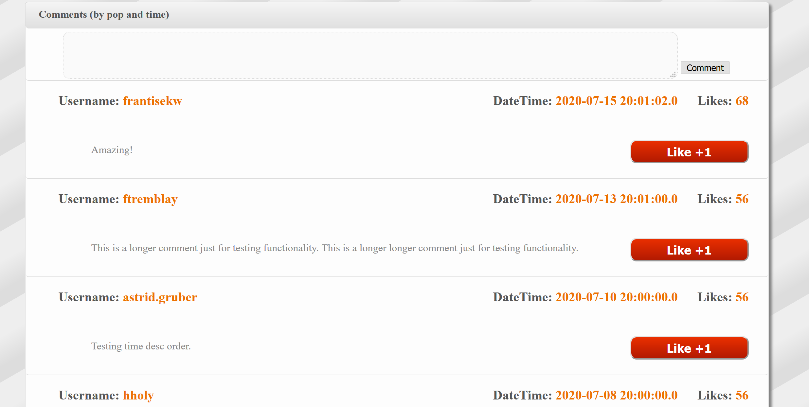

- 新建了一个表`travelcomments`用于存储评论，有五列：`UserName` `Comment` `DateTime` `Likes` `ImageID`.
- 优先按照点赞数排序，再按时效性排序。

#### 3.4 服务器部署

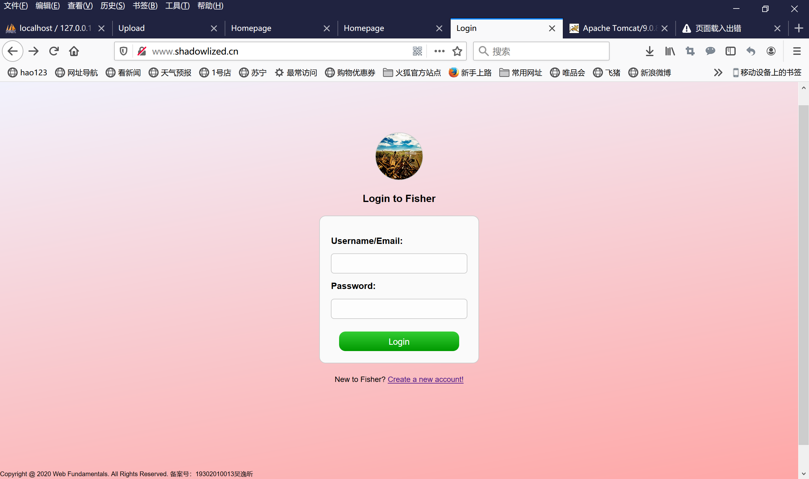

- IP地址129.211.157.164，域名www.shadowlized.cn
- 静态页面的部署已实现并能正常运行，但JavaWeb的部署上遇到了一定问题。

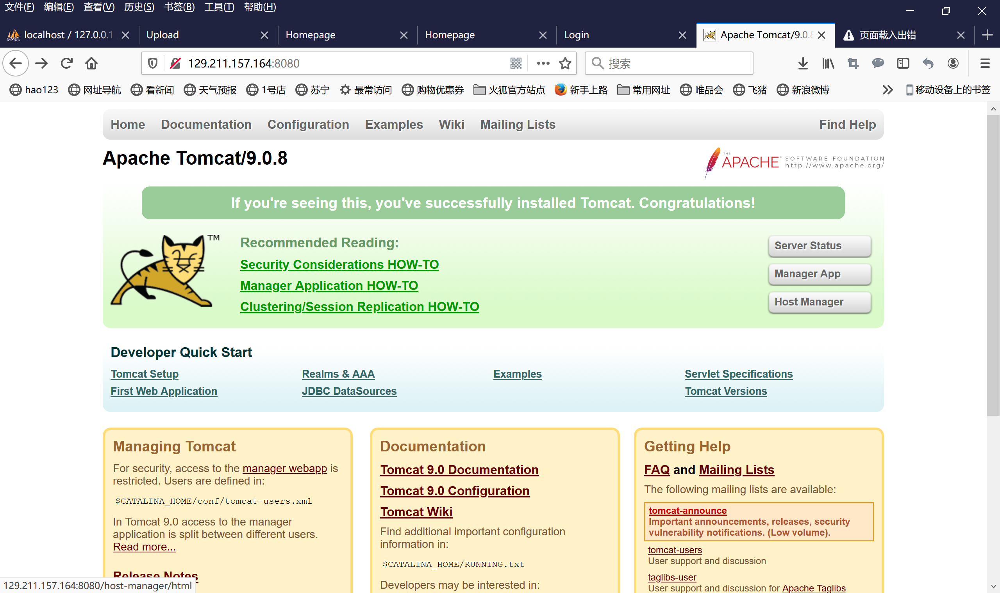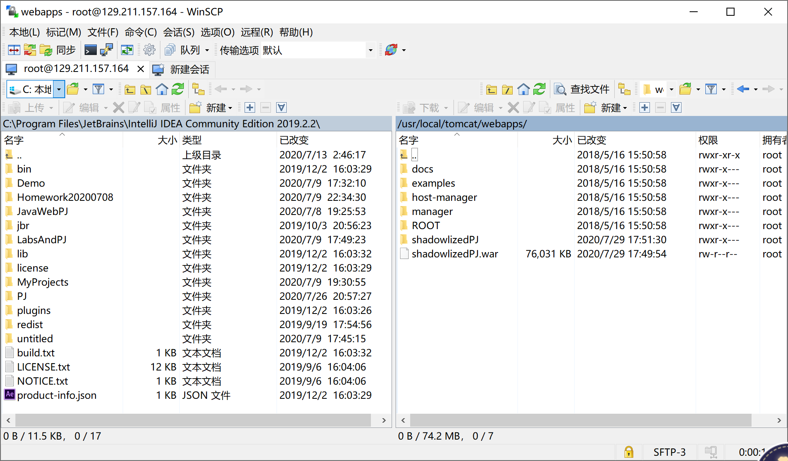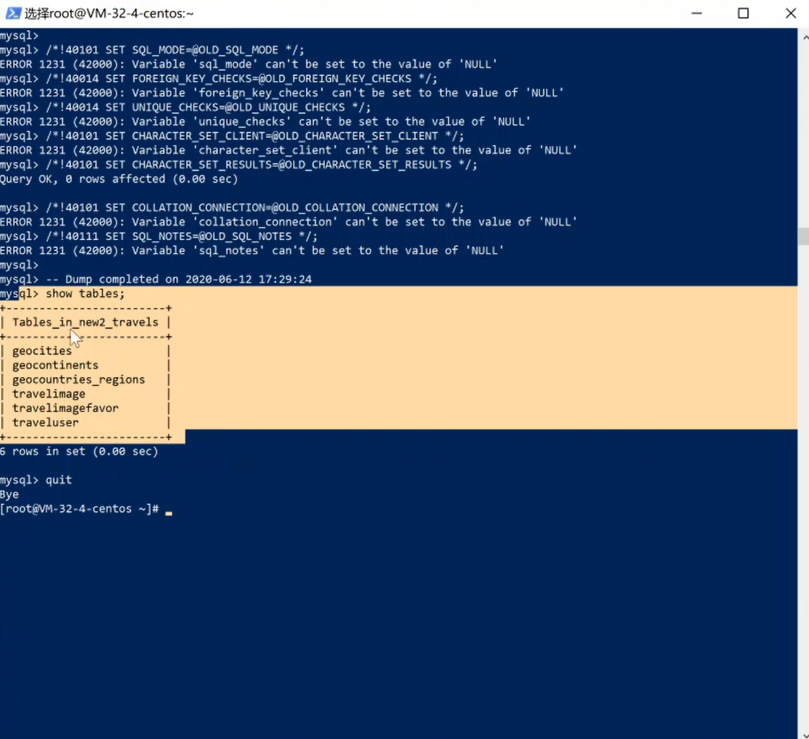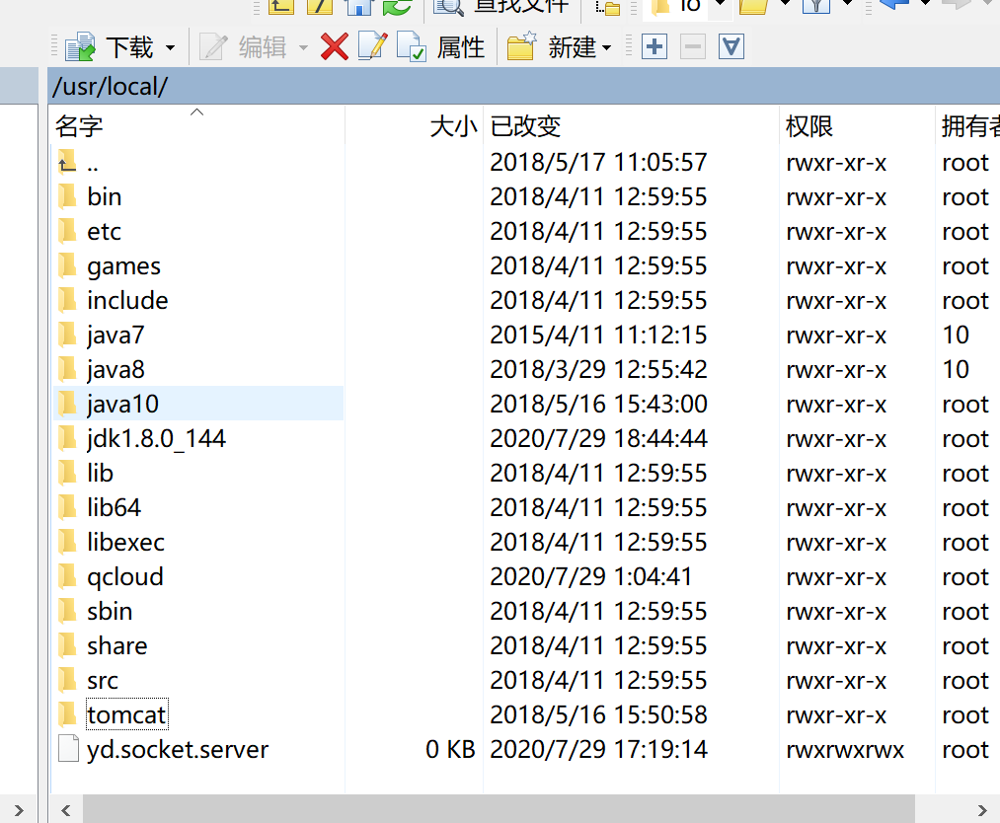

- 已为服务器成功安装Tomcat，并使用MySQL成功向服务器导入了数据库，也配置好了Java环境并将项目的war包部署于服务器tomcat的webapps目录下；但是在重启tomcat时遇到了问题，kill掉进程后无法再次startup，8080端口无法再次连上。
